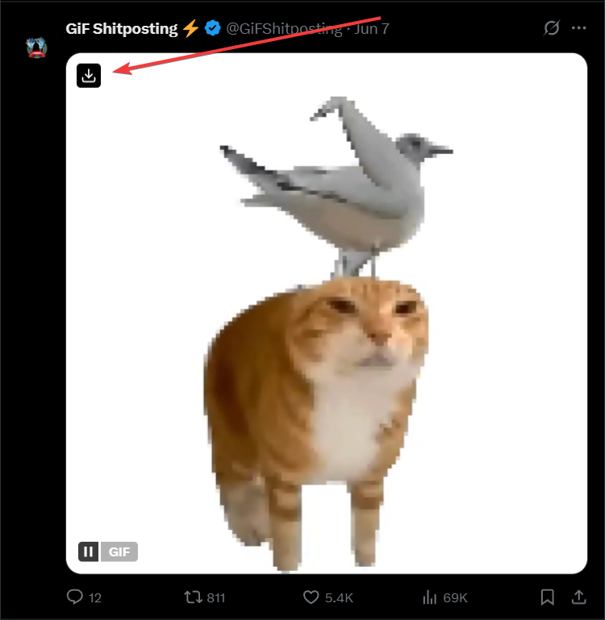

# ChirpCatch

**ChirpCatch** is a lightweight [Tampermonkey](https://www.tampermonkey.net/documentation.php) userscript that enables you to easily download any media—such as videos or images—embedded in tweets on Twitter (now known as X).

Currently the term "downloading" means it will open the media in a new tab that you can
right click to save. I will come up with a new solution soon.

ChirpCatch plans to add more features so ***please*** do suggest anything you may find interesting or useful!

# How to use?
Simple download button on ANY media :>

## Credits

The `findInTree` utility used in this script is adapted from  
[BetterDiscord](https://github.com/BetterDiscord/BetterDiscord)  
[Source Code](https://github.com/BetterDiscord/BetterDiscord/blob/3aef83ad79e67e749ace3add3f80c44ebd1a1fa3/src/common/utils/findintree.ts#L11)

Special thanks to the BetterDiscord team—because writing a React tree traverser is a hassle I didn’t feel like dealing with.